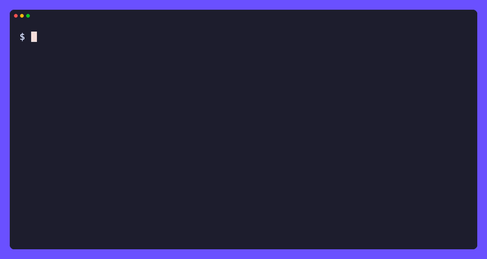

# tori

[](https://github.com/tamnd/tori/actions/workflows/ci.yml)
[](https://github.com/tamnd/tori/releases/latest)
[](https://pkg.go.dev/github.com/tamnd/tori)
[](https://goreportcard.com/report/github.com/tamnd/tori)
[](./LICENSE)

**tori** (鳥, "bird") builds offline, browsable archives of X (Twitter) content.
Point it at a tweet, a thread, a search, or a whole profile and it writes a self-contained folder: the canonical JSON for every post, the photos and video pulled down to local paths, and inert HTML and Markdown views that open with the network unplugged.
It reads X through the free tiers of the [x-cli](https://github.com/tamnd/x-cli) engine, so there is no API key to apply for and nothing to pay.

[Install](#install) • [Quick start](#quick-start) • [Commands](#commands) • [Archive a profile](#archive-a-profile) • [Tiers and auth](#tiers-and-auth) • [How it works](#how-it-works)



You already know the problem.
A thread you wanted to keep is gone because the account went private, or got suspended, or the author thought better of it at 2am.
A bookmark resolves to "This post is unavailable."
You screenshot the good ones, and a screenshot is a picture of text you can no longer search, copy, or follow a link out of.
The posts were never really yours.

tori takes the other road.
It captures the real records (the text, the timestamps, the media, the reply structure) and writes them to disk as plain JSON, then renders that JSON into pages you can read in any browser with no internet at all.
The pages run no JavaScript and phone nobody: the only links in them are the ones tori put there.
Re-run it next month and it fetches only what is new.
The archive is a folder you own, can grep, can hand to a friend, and can open in the year 2040.

Full docs and guides live at **[tori.tamnd.com](https://tori.tamnd.com)**.

## Install

```bash
go install github.com/tamnd/tori/cmd/tori@latest
```

Prefer a prebuilt binary? Grab an archive, a `.deb`/`.rpm`/`.apk`, or a checksum from [releases](https://github.com/tamnd/tori/releases). Or let a package manager handle it:

```bash
# Homebrew (macOS)
brew install tamnd/tap/tori

# Scoop (Windows)
scoop bucket add tamnd https://github.com/tamnd/scoop-bucket
scoop install tori

# apt (Debian, Ubuntu)
curl -fsSL https://tamnd.github.io/linux-repo/gpg.key | sudo gpg --dearmor -o /usr/share/keyrings/tamnd.gpg
echo "deb [signed-by=/usr/share/keyrings/tamnd.gpg] https://tamnd.github.io/linux-repo/apt stable main" | sudo tee /etc/apt/sources.list.d/tamnd.list
sudo apt update && sudo apt install tori

# dnf (Fedora, RHEL)
sudo dnf config-manager --add-repo https://tamnd.github.io/linux-repo/dnf/tamnd.repo
sudo dnf install tori
```

Or use the container image, which carries tori and nothing else (no browser, no runtime):

```bash
docker run --rm -v "$PWD/out:/out" ghcr.io/tamnd/tori archive karpathy --guest
```

tori is pure Go with no browser dependency, so the binary runs anywhere.
The only optional setup is your own X session for the deepest tier (see [Tiers and auth](#tiers-and-auth)); nothing else needs an account.

Shell completion ships in the box: `tori completion bash|zsh|fish|powershell`.

## Quick start

Let's archive Andrej Karpathy's recent posts so you can read them on a plane, on a laptop with no wifi, or after the account is gone:

```bash
# 1. Capture the profile and its recent timeline into $HOME/data/tori/x/karpathy/
tori archive karpathy

# 2. Read it back offline in your browser
tori serve $HOME/data/tori/x/karpathy
# open http://127.0.0.1:8080
```

That is the whole loop.
Every post, every image, the reply threads reassembled, frozen on your disk and readable with zero network.
The next two steps are optional but nice: reach further back in history, and keep the archive current.

```bash
# 3. Walk the full history month by month (sidesteps the ~3200-post timeline cap)
tori archive karpathy --guest --by-month --since 2025-01-01

# 4. Come back next month and fetch only what is new
tori add karpathy
```

## Commands

| Command | What it does |
| --- | --- |
| `tori archive <target>...` | capture a tweet, thread, profile, search, likes, list, or your bookmarks into a repository |
| `tori add <target>...` | re-run a capture and fetch only what is new, then re-render (alias: `update`) |
| `tori render <repo>` | rebuild the HTML and Markdown views from the stored JSON, no network |
| `tori serve <repo>` | preview a repository over a local HTTP server |
| `tori info <repo>` | summarise a repository: counts, date range, tiers used, size |
| `tori auth import\|status\|logout` | manage the X session (Tier 2), shared with x-cli |

## Archive a profile

A profile capture is the headline use.
By default it pulls the recent timeline:

```bash
# Recent timeline + profile + media, no setup at all (Tier 0)
tori archive karpathy

# Page deeper on the free guest tier
tori archive karpathy --guest --max 2000

# Include the replies and retweets, not just standalone posts
tori archive karpathy --guest --with-replies --with-retweets
```

X caps a timeline at roughly the last 3200 posts however you page it.
To reach past that, `--by-month` walks the history in monthly `from:<handle> since:.. until:..` search windows and stitches the results into one repository.
It runs in two passes: it streams the timeline for the recent window first (that reads off a separate rate limit than search), then walks search windows only for the older history the timeline could not reach.
The two passes share one dedupe set, so a profile that fits under the 3200 cap is captured entirely from the timeline with no search windows at all.

```bash
# The whole history, back to the account's first post (import a session first)
tori archive karpathy --by-month --with-replies

# Everything since the start of 2025
tori archive karpathy --by-month --since 2025-01-01

# A specific year
tori archive karpathy --by-month --since 2024-01-01 --until 2025-01-01
```

For a complete history, use a session (the next section), not `--guest`.
The guest tier rate-limits search hard: a long unbounded `--by-month` run hits a 429 with a multi-minute reset, which the engine waits out (the process looks paused, then resumes), so it crawls.
A session has far more search headroom and walks the full history in one sitting; `--guest` is best kept for bounded runs with `--since`.

Add `--with-replies` for a faithful full archive.
A self-thread (the author replying to their own post to continue it) is stored by X as a reply, so without the flag the by-month walk keeps only the standalone posts and drops the rest of every thread.
tori is incremental and resumable throughout: hit Ctrl-C and it keeps what it already wrote; run `tori add` later and it fetches only newer posts.

The flags you'll actually reach for:

| Flag | Default | Meaning |
|------|---------|---------|
| `--by-month` | `false` | Exhaust full history via monthly search windows (needs `--guest` or a session) |
| `--since` / `--until` | | Bound the time range (RFC3339 or `2006-01-02`) |
| `--with-replies` | `false` | Include replies in a profile capture |
| `--with-retweets` | `false` | Include retweets in a profile capture |
| `--media-only` | `false` | Keep only posts that carry media |
| `--max` | `0` | Record budget (0 = as many as the tier gives; defaults to 1000 for a profile/search) |
| `--media` | `all` | Media to localise: `all`, `photos`, or `none` |
| `--video` | `best` | Video rendition: `best` or `worst` |
| `--tool` | | External downloader for stream-only video (e.g. `yt-dlp`) |
| `--view` | `html,md` | Views to render: `html`, `md`, or `html,md` (JSON is always written) |
| `-o, --out` | `$HOME/data/tori` | Output root; the repo lands at `<out>/x/<root>` |
| `--date` | | Fix the capture stamp (RFC3339) for reproducible output |
| `--force` | `false` | Ignore held state and recapture from scratch |
| `--dry-run` | `false` | Print what would be captured without fetching |

`tori archive --help` has the rest.
The same flags drive every target kind.

### Other targets

A profile handle is just one kind of target.
tori captures the rest from the same command:

```bash
tori archive 20                                   # a single tweet by id
tori archive https://x.com/jack/status/20 --thread # the whole conversation
tori archive --search "from:nasa #Artemis" --guest # a search query
tori archive --likes karpathy --guest             # the posts a user liked
tori archive --list 1234567890                    # a List's timeline by id
tori archive --bookmarks                           # your own bookmarks (needs a session)
```

## Tiers and auth

tori reaches X through three free tiers, each deeper than the last.
It picks the lowest one that can do the job; you can open the higher ones explicitly.

| Tier | How to enable | Reaches |
| --- | --- | --- |
| 0 — syndication | nothing, the default | single tweets and a profile's recent window, no auth at all |
| 1 — guest token | `--guest` | deeper timeline paging, search, likes, lists |
| 2 — session | `tori auth import` | the most history and search headroom, plus your own bookmarks |

The session tier uses your own browser cookies, never an API key.
Copy `auth_token` and `ct0` from your logged-in x.com cookies and hand them to tori once:

```bash
tori auth import --auth-token <...> --ct0 <...>   # or set X_AUTH_TOKEN and X_CT0
tori auth status                                   # confirm what is stored
tori auth logout                                   # remove it
```

The cookies are stored locally by the x-cli session package and shared with the `x` CLI if you use it.
Force a specific tier for a run with `--tier syndication|guest|session`.

## How it works

```
target ─▶ x-cli engine ─▶ canonical JSON ─▶ render ─▶ inert HTML + Markdown ─▶ disk
          (free tiers)     (source of truth)  (linkify)   (localise media)
```

tori never scrapes X itself: it imports the [x-cli](https://github.com/tamnd/x-cli) `x` engine and asks it for records.
What comes back is normalised to one canonical JSON shape and written to `tweets/<id>.json`, which is the source of truth for everything else.
The HTML and Markdown views are derived from that JSON, so they are fully regenerable: change the templates and run `tori render <repo>` to rebuild every page with no network.
Media is pulled to local paths and deduplicated by content, and every link inside a rendered page is rewritten to a repository-relative path so the archive resolves offline.
The rendered pages are inert by construction: no script, no event handlers, only the anchors the linkifier emits.

A repository is a self-contained, movable folder:

```
x/karpathy/
├── index.html                # the archive's front page, links to every post
├── README.md                 # a plain-text index of the same
├── profile.json              # the captured profile (bio, counts, avatar)
├── manifest.json             # what was captured, when, which tiers, the range
├── state.json                # incremental cursor, for `tori add`
├── tweets/
│   └── 1234567890.json        # canonical record (source of truth)
├── html/1234567890.html       # the inert per-post page
├── md/1234567890.md           # the same post as Markdown
├── threads/<root>.html        # a reconstructed conversation as one page
├── media/photo|video|gif/...  # localised, deduplicated media
└── _assets/tori.css           # the one stylesheet the pages share
```

Because every path is a deterministic function of the record it holds, a re-capture lands on the exact same files and the output is byte-stable (pass `--date` to fix the footer stamp too).
That makes a repository safe to keep in git, diff between runs, and checksum.

## Building from source

```bash
git clone https://github.com/tamnd/tori
cd tori
make build    # -> bin/tori (pure Go, CGO disabled)
make test     # full suite with the race detector
make install  # -> $GOBIN/tori
```

The repo is split by concern:

```
cmd/tori/   thin main: wires a signal-aware context, hands off to cli.Execute
cli/        the cobra command tree, flag wiring, and exit-code mapping
archive/    the capture loop: target parsing, by-month windows, incremental merge
repo/       the on-disk repository: path mapping, record store, manifest, merge
render/     JSON to inert HTML and Markdown, the linkifier, thread assembly
render/html the HTML view and its templates and CSS
render/md   the Markdown view
thread/     reconstruct a conversation from a set of records
media/      media policy, localisation, and deduplication
docs/       the tago documentation site
```

## Releasing

Push a version tag and GitHub Actions runs GoReleaser, which builds the archives, the `.deb`/`.rpm`/`.apk` packages, a multi-arch GHCR image, checksums, SBOMs, and a cosign signature:

```bash
git tag v0.1.0
git push --tags
```

The image tag carries no `v` prefix (`ghcr.io/tamnd/tori:0.1.0`).
The Homebrew and Scoop steps self-disable until their tokens exist, so the first release works with no extra secrets.

## License

tori is **AGPL-3.0-only**.
It links the x-cli engine, which is AGPL-licensed (it derives from [nitter](https://github.com/zedeus/nitter)), so tori carries the same copyleft.
See [LICENSE](LICENSE) and [NOTICE](NOTICE).
